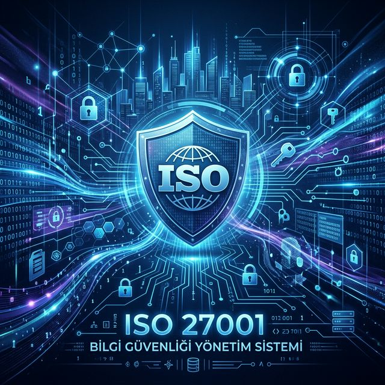

# 🛡️ ISO 27001: Bilgi Güvenliği Yönetim Sistemi (BGYS) Kurumsal Eğitim Portalı

  
  
  
  

---

## 🌟 Bilgi Güvenliğinin Stratejik Önemi
Dijital transformasyonun ivme kazandığı günümüzde, **kurumsal bilginin korunması** bir teknik gereklilikten öte, sürdürülebilir iş modelinin temel taşıdır. Siber tehdit vektörlerinin sofistike hale gelmesi ve yasal regülasyonların (KVKK, GDPR) sıkılaşması, "Bilgi Güvenliği Yönetim Sistemi"ni (BGYS) zorunlu kılmaktadır.

ISO/IEC 27001, kurumların bilgi varlıklarını korumak, riskleri sistematik olarak yönetmek ve iş sürekliliğini sağlamak adına kurgulanmış küresel ölçekteki en prestijli standarttır. Bu portal, söz konusu standartlar bütününü akademik bir disiplinle analiz ederek profesyonellere sunar.

---

## 🏛️ Metodolojik Altyapı
Sistem, üç temel dokümantasyon ve uygulama sütunu üzerine inşa edilmiştir:

1.  **CIA Triad:** Bilginin Gizliliği (Confidentiality), Bütünlüğü (Integrity) ve Erişilebilirliği (Availability).
2.  **Risk Odaklı Yaklaşım:** Tehdit ve zafiyet analizi ile kritik varlıkların dinamik korunması.
3.  **PUKO Döngüsü:** Sürekli iyileştirme için Planla, Uygula, Kontrol Et ve Önlem Al (PDCA).

---

## 🗺️ Eğitim ve Uygulama Müfredatı

| Modül | Teknik Kapsam | Durum |
| :--- | :--- | :--- |
| **[01. Temel Kavramlar](./modules/01-temel-kavramlar.md)** | BGYS Prensipleri, CIA Analizi, PUKO Süreçleri | ✅ Yayında |
| **[02. Risk Yönetimi](./modules/02-risk-yonetimi.md)** | Varlık Envanter Yönetimi, Tehdit Modelleme, Risk İşleme | ✅ Yayında |
| **[03. Ek-A Kontrolleri](./modules/03-ek-a-kontrolleri.md)** | 114 Kontrolün Teknik Analizi ([Tam Liste](./modules/Annex-A-Tam-Liste.md)) | ✅ Yayında |
| **[04. Denetim & Yönetim](./modules/04-denetim-ve-yönetim.md)** | İç Tetkik Metodolojisi, YGG ve Uygunsuzluk Yönetimi | ✅ Yayında |
| **[05. Politika & Doküman](./modules/05-politika-ve-dokümantasyon.md)** | Kurumsal Politikalar ve Operasyonel Kayıt Standartları | ✅ Yayında |
| **[06. Sınava Hazırlık](./exam-prep/soru-bankasi.md)** | Profesyonel Sertifikasyon Sınavları Hazırlık Seti | ✅ Yayında |

---

## 🏗️ Kurumsal Uygulama ve Kritik Başarı Faktörleri
ISO 27001 implementasyonunda kurumsal başarı için aşağıdaki stratejik noktalar gözetilmelidir:

- **Kapsam Optimizasyonu:** Kurumsal sınırların (Boundaries) risk analizi çıktılarına göre optimize edilmesi.
- **Kanıta Dayalı Yönetim:** Denetim süreçlerinde "Beyan" yerine "Kanıt" (Evidence) esaslı bir yapı kurgulanmalıdır.
- **Liderlik ve Taahhüt:** Üst yönetimin kaynak tahsisi ve stratejik desteği, sistemin can damarıdır.

---

## 🔍 Denetim Katmanları: İç Tetkik vs. Sertifikasyon
Denetim mekanizmalarının doğru anlaşılması, uyum sürecinin temelidir:

| Kriter | İç Tetkik (Madde 9.2) | Sertifikasyon Denetimi |
| :--- | :--- | :--- |
| **Uygulayıcı** | Bağımsız İç Denetçi veya Danışman. | Akredite Dış Denetçi. |
| **Odak Noktası** | Gelişim alanları ve düzeltici aksiyonlar. | Standart uyumluluk onayı ve belgelendirme. |
| **Çıktı** | Yönetim Raporu / Aksiyon Planı. | ISO 27001 Uluslararası Sertifikası. |

---

## 👨‍💻 Hazırlayan ve Vizyon
Bu portal, kurumsal bilgi güvenliği standartlarının standardizasyonu ve yaygınlaştırılması amacıyla **Bahattin Yunus Çetin** tarafından geliştirilmiştir.

**Bahattin Yunus Çetin**  
*IT Architect*

- **GitHub:** [github.com/bahattinyunus](https://github.com/bahattinyunus)
- **LinkedIn:** [linkedin.com/in/bahattinyunus](https://www.linkedin.com/in/bahattinyunus/)
- **Vizyon:** "Teknolojik mimari, güvenlikle harmanlandığında kurumsal bir değer üretir."

---

## 🤝 Katkıda Bulunma ve Ekosistem
Bu proje, akademik bir referans kaynağı olarak sürekli güncellenmektedir. Katkı sağlamak, yeni vaka analizleri eklemek veya soru bankasını genişletmek için [Katkı Rehberi](./CONTRIBUTING.md) üzerinden ilerleyebilirsiniz.

- **Star:** Projeye destek olmak için yıldız verebilirsiniz. ⭐
- **Fork:** Kendi implementasyonlarınız için çatallayabilirsiniz. 🚜

---
**Lisans:** [MIT](./LICENSE)  
**Müellif:** Bahattin Yunus Çetin
