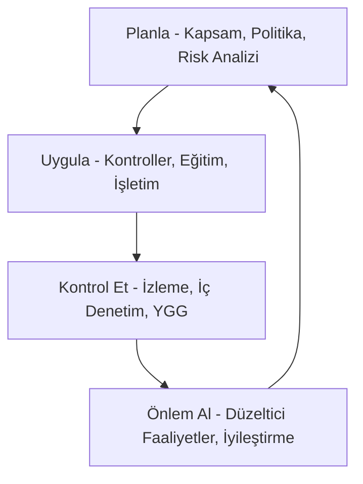

# 📘 Modül 01: Temel Kavramlar

Bu modül, Bilgi Güvenliği Yönetim Sistemi'nin (BGYS) temel taşlarını ve ISO 27001 standardının ana felsefesini kapsar.

## 🛡️ Bilgi Güvenliği Nedir?
Bilgi güvenliği; bilgiyi tehditlerden korumak, iş sürekliliğini sağlamak, iş kayıplarını en aza indirmek ve yatırımların geri dönüşünü ve iş fırsatlarını maksimize etmek amacıyla yapılan faaliyetlerdir.

### 🏛️ CIA Üçlüsü (Temel Direkler)
Bilgi güvenliği üç ana unsurun korunması üzerine inşa edilir:

1.  **Gizlilik (Confidentiality):** Bilginin sadece yetkili kişilerce erişilebilir olması.
    *   *Örnek:* Veri şifreleme, erişim kontrolleri.
2.  **Bütünlük (Integrity):** Bilginin doğruluğunun ve tamlığının korunması.
    *   *Örnek:* Hash (özet) algoritmaları, dijital imzalar.
3.  **Erişilebilirlik (Availability):** Bilginin ve sistemlerin ihtiyaç duyulduğunda yetkili kullanıcılara hazır olması.
    *   *Örnek:* Yedekleme, yüksek kullanılabilirlik (HA), DDoS koruması.

---

## 🔄 BGYS Yaşam Döngüsü (PUKO Modeli)
ISO 27001, sürekli iyileştirme için **PUKO (Planla - Uygula - Kontrol Et - Önlem Al)** döngüsünü benimser:

| Faz | Açıklama |
| :--- | :--- |
| **Planla** | Kapsamın belirlenmesi, risk değerlendirmesi ve politika oluşturma. |
| **Uygula** | Kontrollerin hayata geçirilmesi, risk işleme planının uygulanması. |
| **Kontrol Et** | Performansın ölçülmesi, iç denetimler ve izleme faaliyetleri. |
| **Önlem Al** | Uygunsuzlukların giderilmesi, BGYS'nin sürekli iyileştirilmesi. |

---

## 🏛️ ISO 27001 Standart Yapısı
Standardın ana maddeleri şunlardır:
- **Madde 4:** Kuruluşun Bağlamı
- **Madde 5:** Liderlik
- **Madde 6:** Planlama (Risklerin Belirlenmesi)
- **Madde 7:** Destek
- **Madde 8:** İşletim
- **Madde 9:** Performans Değerlendirme
- **Madde 10:** İyileştirme

---
**[Geri Dön - README](../README.md)**
