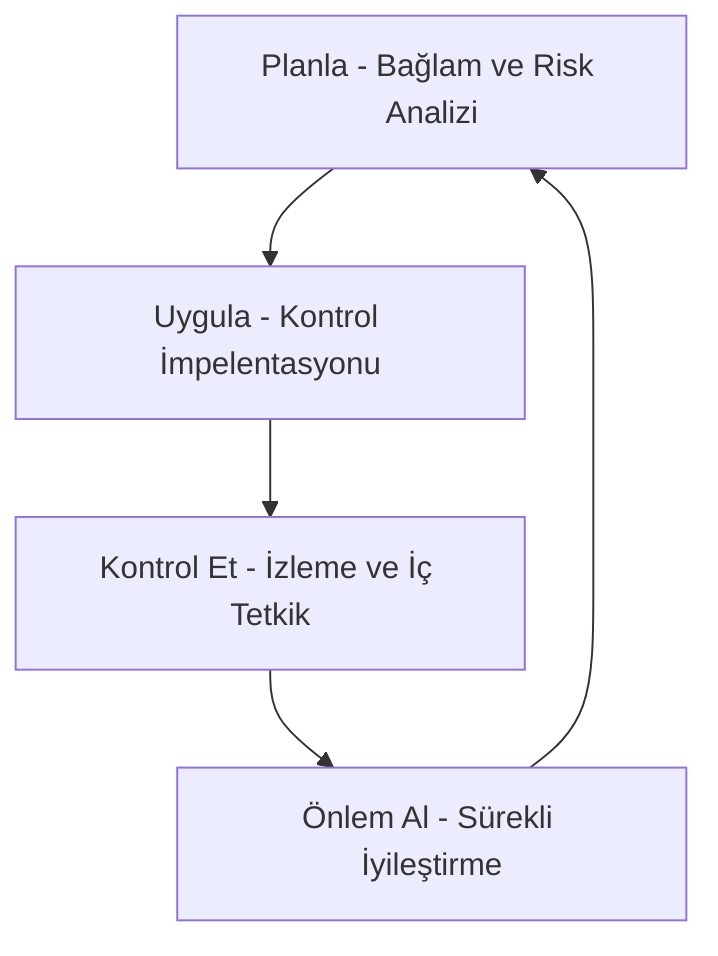

# 📘 Modül 01: Bilgi Güvenliği Temel Prensipleri

Bu modül, Bilgi Güvenliği Yönetim Sistemi'nin (BGYS) kurumsal temellerini ve ISO 27001 standardının metodolojik felsefesini analiz eder.

## 🛡️ Stratejik Bilgi Güvenliği Yaklaşımı
Bilgi güvenliği; kurumsal verileri tehdit matrisinden korumak, iş sürekliliğini teminat altına almak ve finansal/operasyonel riskleri asgariye indirmek amacıyla yürütülen stratejik faaliyetler bütünüdür.

### 🏛️ CIA Triad (Temel Direkler)
Bilgi güvenliği mimarisi üç ana sütun üzerine inşa edilir:

1.  **Gizlilik (Confidentiality):** Verinin yalnızca yetkilendirilmiş paydaşlar tarafından erişilebilir olması.
    *   *Uygulama:* Kriptografik yöntemler, Granüler Erişim Kontrolleri.
2.  **Bütünlük (Integrity):** Verinin iletim ve saklama süreçlerinde yetkisiz tahrifata uğramadan, doğruluk ve tamlığının korunması.
    *   *Uygulama:* Dijital İmzalar, Hash Fonksiyonları.
3.  **Erişilebilirlik (Availability):** Sistemlerin ve verilerin ihtiyaç duyulduğunda yetkili kullanıcılar için kesintisiz hazır bulunması.
    *   *Uygulama:* Yüksek Kullanılabilirlik (HA), Felaketten Kurtarma (DR) ve DDoS Tahribat Önleme.

---

## 🔄 BGYS Yaşam Döngüsü (PUKO/PDCA Modeli)
ISO 27001, sürekli gelişim vizyonu ile **Planla - Uygula - Kontrol Et - Önlem Al** döngüsünü temel alır:

| Faz | Kurumsal Faaliyet |
| :--- | :--- |
| **Planla** | Kapsam tanımı, risk metodolojisi ve politika setlerinin oluşturulması. |
| **Uygula** | Kontrollerin operasyona entegrasyonu ve farkındalık eğitimleri. |
| **Kontrol Et** | Performans metriklerinin ölçülmesi ve bağımsız iç tetkikler. |
| **Önlem Al** | Uygunsuzluk yönetimi ve BGYS'nin dinamik optimizasyonu. |

---

## 🏛️ ISO 27001 Regülatif Standart Yapısı
Standardın ana maddeleri kurumsal uyum için zorunluluk arz eder:
- **Madde 4:** Kuruluşun Bağlamı (İç ve Dış Hususlar)
- **Madde 5:** Liderlik ve Taahhüt
- **Madde 6:** Planlama (Risk ve Fırsat Yönetimi)
- **Madde 7:** Destek ve Kaynak Yönetimi
- **Madde 8:** İşletim ve Kontrol
- **Madde 9:** Performans Değerlendirme (İzleme ve Ölçme)
- **Madde 10:** İyileştirme (Düzeltici Faaliyetler)

---
**[Ana Sayfa - README](../README.md)**
