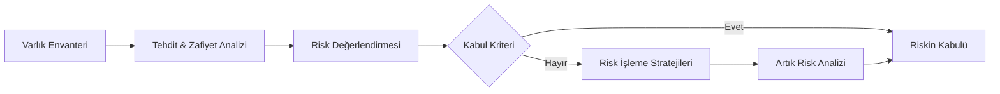

# ⚖️ Modül 02: Bilgi Güvenliği Risk Yönetimi

Risk yönetimi, ISO 27001 standardının metodolojik merkezidir. Kurumsal varlıkların korunması için gerekli olan kontrol matrisini belirleyen dinamik bir süreçtir.

## 🛡️ Risk Kavramı ve Formülasyonu
**Risk = [Tehdit x Zafiyet (Açıklık)] x Etki (Impact)**

Bir tehdit unsurunun, belirli bir varlık üzerindeki yapısal zayıflığı (zafiyeti) kullanarak kurumsal hedeflere zarar verme potansiyelini ifade eder.

---

## 📅 Risk Yönetim Metodolojisi

1.  **Varlık Envanter Yönetimi:** Kurumsal veri, donanım, yazılım ve insan kaynağının stratejik önem derecesine göre tanımlanması.
2.  **Tehdit ve Zafiyet Analizi:** Olası tehdit vektörlerinin ve varlıklardaki zayıf noktaların analitik tespiti.
3.  **Risk Derecelendirme:** Riskin gerçekleşme olasılığı (Probability) ve olası operasyonel etkisi (Impact) üzerinden sayısal skorlama.
4.  **Risk İşleme (Risk Treatment):** Belirlenen riskler için uygulanacak aksiyon planlarının kurgulanması.

---

## 🛠️ Stratejik Risk İşleme Seçenekleri
ISO 27001 kapsamında dört temel risk işleme yaklaşımı benimsenir:

| Strateji | Operasyonel Açıklama |
| :--- | :--- |
| **Risk Azaltma (Migration / Mitigation)** | Uygun kontrollerle riski kabul edilebilir seviyeye indirmek (örn: Firewall/WAF entegrasyonu). |
| **Risk Kaçınma (Avoidance)** | Riski tetikleyen faaliyetin veya varlığın devre dışı bırakılması (örn: Desteklenmeyen bir servisi durdurmak). |
| **Risk Paylaşımı (Transfer)** | Finansal veya operasyonel yükün dış taraflara devri (örn: Siber Güvenlik Sigortası). |
| **Risk Kabulü (Acceptance)** | Riskin organizasyonel limitler dahilinde olduğu kabul edilerek mevcut durumun sürdürülmesi. |

---

## 📜 Uygulanabilirlik Bildirgesi (SoA)
Risk işleme planının bir çıktısı olarak hangi Ek-A kontrollerinin seçildiği ve gerekçeleri **Uygulanabilirlik Bildirgesi (Statement of Applicability)** dokümanında resmileştirilir.

---
**[Ana Sayfa - README](../README.md)**
