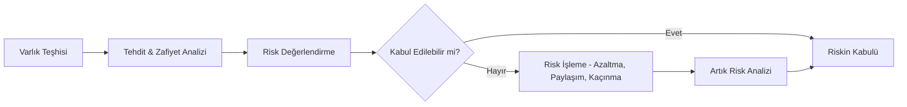

# ⚖️ Modül 02: Risk Yönetimi

Risk yönetimi, ISO 27001'in kalbidir. Sistemin neyi, neden ve nasıl koruduğunu belirleyen süreçtir.

## 🛡️ Risk Nedir?
**Risk = [Tehdit x Açıklık (Zafiyet)] x Etki**

Bir tehdit, bir varlığın zayıflığını (zafiyetini) kullanarak o varlığa zarar verme ihtimalini ifade eder.

---

## 📅 Risk Yönetimi Süreci

1.  **Varlık Teşhisi:** Kuruluşun sahip olduğu bilgi varlıkları tespiti (Donanım, Yazılım, Veri, Personel).
2.  **Tehdit ve Zafiyet Analizi:** Varlıkları tehdit eden unsurların ve varlıklardaki zayıflıkların belirlenmesi.
3.  **Risk Değerlendirmesi:** Riskin olasılığı ve olası etkisinin hesaplanması (Genellikle 1-5 veya 1-3 skalası kullanılır).
4.  **Risk İşleme (Treatment):** Belirlenen riskler için aksiyon alınması.

---

## 🛠️ Risk İşleme Seçenekleri
ISO 27001'de dört temel risk işleme seçeneği bulunur:

| Seçenek | Açıklama |
| :--- | :--- |
| **Risk Azaltma (Migration)** | Kontrol uygulayarak riski kabul edilebilir seviyeye indirmek (örn: Güvenlik duvarı kurmak). |
| **Risk Kaçınma (Avoidance)** | Riski oluşturan faaliyetten vazgeçmek (örn: Tehlikeli bir servisi kapatmak). |
| **Risk Paylaşımı (Transfer)** | Riskin etkisini başkasına devretmek (örn: Siber sigorta yaptırmak). |
| **Risk Kabulü (Acceptance)** | Riski olduğu gibi kabul etmek (Düşük riskler için geçerlidir). |

---

## 📜 Uygulanabilirlik Bildirgesi (SoA)
Risk analizi sonucunda hangi Ek-A kontrollerinin seçildiği ve neden seçildiği **Uygulanabilirlik Bildirgesi (SOA)** dokümanında raporlanır. Seçilmeyen kontrollerin neden seçilmediği (uygulanabilir olmadığı) da burada açıklanmalıdır.

---
**[Geri Dön - README](../README.md)**
